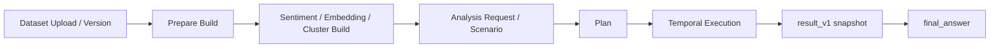

# 분석 실행 플랫폼

질문이나 strict 시나리오를 `Skill Plan`으로 바꾸고, 실행 결과를 `result_v1`과 `final_answer`로 남기는 분석 실행 플랫폼이다.

현재 런타임 조합:
- `Go control plane`
- `Temporal workflow`
- `Postgres`
- `DuckDB`
- `Python AI worker`
- `Vite + React + TypeScript` 프론트 스캐폴드

## 핵심 흐름



- 비정형 dataset version은 생성 시 `prepare` build를 먼저 enqueue한다.
- `sentiment`, `embedding`, `cluster`는 필요한 plan step이 있을 때 자동 build 후 resume한다.
- full-dataset `embedding_cluster`는 precomputed cluster artifact를 우선 사용한다.
- 현재 planning mode는 `strict` 중심이며, 프론트에서 붙일 `progress / events / step preview / result` API는 준비되어 있다.

## 빠른 시작

```bash
docker compose -f compose.dev.yml up -d --build
```

기본 주소:
- control plane: `http://127.0.0.1:18080`
- python-ai worker: `http://127.0.0.1:18090`
- Swagger UI: `http://127.0.0.1:18080/swagger`

기본 검증:

```bash
cd apps/control-plane && go test ./...
PYTHONPATH=workers/python-ai/src python3 -m unittest discover -s workers/python-ai/tests -p 'test_*.py'
PYTHONPATH=workers/python-ai/src python3 -m python_ai_worker.devtools.run_skill_case --validate
```

## 먼저 볼 문서

- [docs/project_summary.md](docs/project_summary.md)
  - 현재 제품 정의와 핵심 실행 흐름
- [manual.md](manual.md)
  - 로컬 운영 입구
- [docs/operations/local_runbook.md](docs/operations/local_runbook.md)
  - stack 실행, health, 로그, artifact 경로
- [docs/api/openapi.yaml](docs/api/openapi.yaml)
  - HTTP API 계약
- [docs/skill/skill_registry.md](docs/skill/skill_registry.md)
  - 공식 runtime skill 계약
- [docs/skill/skill_implementation_status.md](docs/skill/skill_implementation_status.md)
  - 스킬별 구현 방식과 안정도

참고:
- [apps/control-plane/README.md](apps/control-plane/README.md), [workers/python-ai/README.md](workers/python-ai/README.md)는 입구 문서가 아니라 코드맵 README다.
- 프론트 연동 순서는 [docs/operations/frontend_handoff.md](docs/operations/frontend_handoff.md)를 본다.
- prompt/profile/policy registry는 [config/prompts/README.md](config/prompts/README.md), [config/dataset_profiles.json](config/dataset_profiles.json), [config/skill_policies/README.md](config/skill_policies/README.md)를 기준으로 본다.

## 현재 상태

- 현재 단계는 `실행 경로와 운영 확인 surface가 붙은 MVP`다.
- startup reconciliation, build/execution diagnostics, `operations/summary`, `runtime_status`로 기본 recoverability를 확보했다.
- 확인 필요: Temporal workflow history 장기 보존은 아직 dev server 기본값을 따른다.
