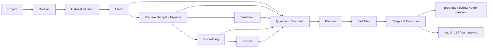

# 분석 지원 플랫폼

LLM을 planner와 분석 보조 레이어로 사용해, 사용자의 자연어 분석 요청을 실행 가능한 `Skill Plan`으로 바꾸고 데이터 준비부터 분석 실행, 결과 정리까지 이어가는 분석 에이전트 플랫폼이다.

데이터는 프로젝트와 dataset version 기준으로 관리하고, LLM이 만든 계획은 등록된 skill과 검증 가능한 execution 흐름으로 고정한다. 이를 통해 분석 담당자가 매번 파일, 프롬프트, 실행 조건을 수동으로 맞추지 않아도 같은 입력과 plan 기준으로 결과를 추적하고 재사용할 수 있게 만드는 것을 목표로 한다.

## 무엇을 제공하나

- 프로젝트별 dataset, dataset version, prompt, scenario를 관리한다.
- 업로드한 원본 데이터를 `clean -> prepare -> sentiment / embedding -> cluster` 단계로 build한다.
- Planner가 사용자 질문을 해석해 실행할 분석 skill 목록을 `Skill Plan`으로 고정한다.
- 질문 또는 strict 시나리오에서 생성된 `Skill Plan`을 Temporal workflow로 실행한다.
- 실행 중간 상태는 `progress / events / step preview`로 노출하고, 완료 결과는 `result_v1`과 `final_answer`로 저장한다.
- 선택한 execution 결과를 기반으로 보고서 초안 스냅샷을 생성한다.
- 프론트가 붙을 수 있도록 OpenAPI, frontend OpenAPI, 로컬 `.http` 호출 파일을 제공한다.

## 핵심 개념

| 개념 | 설명 |
| --- | --- |
| Project | 분석 작업의 최상위 단위. dataset, prompt, scenario, execution을 묶는다. |
| Dataset | SNS 데이터, 정형 데이터처럼 같은 성격의 데이터 묶음이다. |
| Dataset Version | 실제 분석에 사용하는 구체적인 업로드 데이터다. 분석 기록은 version 기준으로 남긴다. |
| Active Version | 일반 질의에서 기본으로 사용할 dataset version이다. |
| Build Stage | `source`, `clean`, `prepare`, `sentiment`, `embedding`, `cluster` 같은 데이터 준비 단계다. |
| Skill Plan | 질문이나 시나리오를 실행 가능한 skill step 목록으로 고정한 계획이다. |
| Execution | Skill Plan을 실제로 실행한 기록과 결과다. |
| Report Draft | 선택한 execution 결과를 보고서 초안 형태로 저장한 스냅샷이다. |

## 목표 사용자 흐름

1. 분석가는 분석 맥락에 맞는 Project를 만들고 Dataset을 등록한다.
2. Dataset에 실제 분석 대상 파일을 업로드하면 Dataset Version이 생성된다.
3. 분석가는 자연어 Goal을 입력하거나 분석팀이 정의한 Scenario를 선택한다.
4. Planner는 Goal 또는 strict Scenario를 실행 가능한 Skill Plan으로 만든다.
5. Control plane은 Plan의 skill, 입력, dataset version, build dependency를 검증하고 정규화한다.
6. Execution은 정규화된 Plan을 순차 실행하고 중간 상태와 결과를 저장한다.
7. 저장된 execution 결과는 비교, 재실행, 보고서 초안 생성에 재사용된다.

## Planner 역할 (planner_v2)

δ-1~δ-4 (2026-05-21)로 옛 rule-based planner는 폐기됐다. 현재는 **planner_v2** (LLM)가 분석 plan을 생성한다.

1. 사용자가 요청에 넣은 `dataset_id` 또는 `dataset_version_id`를 control plane이 해석한다 (`dataset_id`만 들어오면 active version 자동 선택).
2. control plane이 dataset version의 artifact_paths(cleaned.parquet / clause_label.jsonl / doc_genuineness.jsonl)를 plan_v2 request에 inline 주입한다.
3. planner_v2가 Anthropic LLM strict-mode JSON으로 plan_v2를 생성한다 — 8 표준 skill(join / filter / aggregate / compare / calculate / sort / present / summarize)과 3 RESERVED input table(docs / clauses / genuineness)을 조합.
4. executor_v2가 DuckDB로 plan_v2 step을 결정론적으로 순차 실행한다.
5. plan + 결과가 응답 body로 반환된다 (DB 저장 없음, stateless).

plan_v2 8 skill catalog는 `workers/python-ai/src/python_ai_worker/planner_v2/schema.py:SKILL_CATALOG`로 잠금. validator가 schema/skill 범위/identifier 안전성을 검사하고 self-correct retry 1회 한다.

## Skill 확장 방향

기존 skill_bundle.json(fixed registry) 방식은 폐기됐다. planner_v2가 정의된 8개 표준 skill만으로 분석 흐름을 LLM이 직접 조합한다. 새 표준 skill을 추가하려면 `planner_v2/schema.py:SKILL_CATALOG` + `executor_v2/skills/` 핸들러 + validator 검사 규칙을 함께 갱신한다.

## 비정형 분석 방향

비정형 분석은 비용이 큰 모델 실행과 결정론적 집계를 분리하는 방향으로 설계한다.

- Python AI worker가 별도 실행 서비스로 동작하며 `clean / prepare / sentiment / embedding / cluster` build와 비정형 skill을 담당한다.
- 임베딩, 감성 분류, 클러스터링처럼 비용이 큰 처리는 artifact로 저장한다.
- 플랫폼의 plan skill은 저장된 artifact와 지표를 기반으로 집계, 비교, 요약 결과를 구성한다.
- 운영은 분리하지만, plan/execution/result 관리는 정형 skill과 동일한 방식으로 통합한다.

## 제품 흐름



기본 정책:

- 업로드 후 `clean`은 기본 build 단계로 본다.
- `prepare`는 LLM 비용이 큰 단계라 `prepare_sample`로 먼저 확인하고 필요할 때 실행한다.
- `sentiment`와 `embedding`은 `prepare` 이후 병렬 실행 가능하다.
- `cluster`는 `embedding` 결과가 있어야 실행 가능하다.
- 분석 소스는 `prepared ready -> cleaned ready -> raw` 순서로 해석한다.
- dataset version 상세 응답의 `build_stages`가 프론트 상태 표시의 기준이다.

## 런타임 구성

| 구성 요소 | 역할 |
| --- | --- |
| Go control plane | 프로젝트, dataset, build job, plan, execution API와 orchestration |
| Python AI worker | planner, dataset build, 비정형 분석 skill, final answer 생성 |
| Temporal | dataset build workflow와 analysis workflow 실행 |
| Postgres | metadata, execution, build job, artifact index 저장 |
| Artifact storage | 업로드 원본과 Parquet/JSON build 산출물 저장 |
| DuckDB | 정형 데이터 skill 실행 |
| Vite/React scaffold | 프론트 POC 진입점 |

## 빠른 시작

```bash
docker compose -f compose.dev.yml up -d --build
```

기본 주소:

- control plane: `http://127.0.0.1:18080`
- python-ai worker: `http://127.0.0.1:18090`
- Swagger UI: `http://127.0.0.1:18080/swagger`

로컬 API 호출 예시는 [docs/api/local.http](docs/api/local.http)를 사용한다.

## 검증

```bash
(cd apps/control-plane && go test ./...)
PYTHONPATH=workers/python-ai/src python3 -m unittest discover -s workers/python-ai/tests -p 'test_*.py'
PYTHONPATH=workers/python-ai/src python3 -m python_ai_worker.devtools.run_skill_case --validate
ruby -e 'require "yaml"; YAML.load_file("docs/api/openapi.yaml"); puts "ok"'
```

### CI

push / merge request마다 위 검증을 자동 실행한다. GitLab은 `.gitlab-ci.yml`, GitHub은 `.github/workflows/ci.yml`로 동일한 3 job을 돈다.

- `go-test`: `apps/control-plane` 에서 `go build ./...` + `go test ./...`
- `python-test`: **Python 3.11** 에서 `pip install -e workers/python-ai` 후 `unittest discover`
- `release-guard`: `openapi.yaml` / `openapi.frontend.yaml` YAML parse + boot-time destructive SQL guard

외부 서비스(LLOA/Anthropic) + docker compose 의존 smoke는 CI에서 제외한다. 로컬에서 `./scripts/ci.sh` (smoke 포함) 또는 `./scripts/ci.sh --no-smoke` 로 실행한다.

주요 smoke script:

- `apps/control-plane/dev/smoke.sh`: 기본 request -> plan -> execute 흐름 확인
- `apps/control-plane/dev/smoke_auto_resume_sentiment.sh`: sentiment build 후 waiting execution 자동 재개 확인
- `apps/control-plane/dev/smoke_auto_resume_embedding.sh`: embedding build 후 waiting execution 자동 재개 확인
- `apps/control-plane/dev/smoke_auto_resume_cluster.sh`: cluster build 후 waiting execution 자동 재개 확인
- `apps/control-plane/dev/smoke_final_answer.sh`: 실행 완료 후 `final_answer` 생성 확인
- `apps/control-plane/dev/smoke_semantic.sh`: semantic search와 retrieval 확인
- `apps/control-plane/dev/smoke_cluster.sh`: cluster build와 `embedding_cluster` 결과 확인

## 주요 문서

- [docs/api/openapi.yaml](docs/api/openapi.yaml): 전체 HTTP API 계약
- [docs/api/openapi.frontend.yaml](docs/api/openapi.frontend.yaml): 프론트 필수 API 계약
- [docs/api/local.http](docs/api/local.http): 로컬 API 호출 예시
- [docs/skill/skill_registry.md](docs/skill/skill_registry.md): runtime skill 계약
- [docs/skill/skill_implementation_status.md](docs/skill/skill_implementation_status.md): skill별 구현 방식과 안정도
- [docs/architecture/project_map.mmd](docs/architecture/project_map.mmd): 현재 컴포넌트 관계도

## 현재 범위

- 현재 단계는 `실행 경로와 운영 확인 surface가 붙은 MVP`다.
- planning mode는 `strict` 중심으로 운영한다.
- startup reconciliation으로 재기동 후 남아 있던 build job과 execution을 다시 평가한다.
- `GET /runtime_status`로 현재 런타임 보장 범위를 조회할 수 있다.
- 확인 필요: Rust worker는 현재 hot path runtime에 연결되지 않았다.
- 확인 필요: Temporal workflow history 장기 보존은 아직 dev server 기본값을 따른다.

## POC 이후 TODO

- Dataset build 진행률은 우선 polling으로 `build_stages[].latest_job.diagnostics.progress`를 표시하고, POC 이후 sentiment / embedding / cluster progress 보강 및 SSE 전환을 검토한다.
