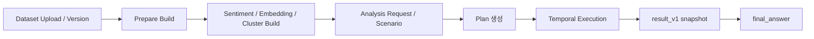

# 분석 실행 플랫폼

질문이나 시나리오를 `Skill Plan`으로 바꾸고, 실행 결과를 재현 가능하게 남기는 분석 실행 플랫폼이다.

현재 구현 중심은 다음 조합이다.
- `Go control plane`
- `Temporal workflow`
- `Postgres`
- `DuckDB`
- `Python AI worker`
- `Vite + React + TypeScript` 프론트 스캐폴드

## 무엇을 하는가

- dataset upload / version / profile 관리
- `prepare -> sentiment / embedding / cluster` build orchestration
- `request -> plan -> execute -> result -> final_answer` 실행 흐름
- strict scenario 등록, import, one-shot execute
- execution snapshot 저장, rerun / diff, report draft 생성

## 현재 범위

- 비정형 dataset version은 생성 시 `prepare` async job을 기본으로 enqueue한다.
- `sentiment`, `embedding`, `cluster`는 필요한 plan step이 있을 때 자동 build 후 resume한다.
- `embedding_cluster`는 full-dataset 경로에서 precomputed cluster artifact를 우선 읽고, 없으면 on-demand clustering으로 fallback 한다.
- `final_answer`는 `result_v1 + evidence`를 바탕으로 생성되는 후처리 레이어다.
- 현재 시나리오 planning mode는 `strict`만 지원한다.
- 확인 필요: `workers/rust-skills/`는 아직 hot path runtime에 연결되지 않았다.

## 구조



## 빠른 시작

### 1. 개발 stack 실행

```bash
docker compose -f compose.dev.yml up -d --build
```

기본 주소:
- control plane: `http://127.0.0.1:18080`
- python-ai worker: `http://127.0.0.1:18090`
- Swagger UI: `http://127.0.0.1:18080/swagger`

### 2. 기본 검증

```bash
cd apps/control-plane && go test ./...
PYTHONPATH=workers/python-ai/src python3 -m unittest discover -s workers/python-ai/tests -p 'test_*.py'
PYTHONPATH=workers/python-ai/src python3 -m python_ai_worker.devtools.run_skill_case --validate
```

### 3. 프론트 스캐폴드 실행

```bash
cd apps/web
npm install
npm run dev
```

## 문서 안내

### 제품과 입구

| 문서 | 역할 |
| --- | --- |
| [README.md](README.md) | 제품 개요와 빠른 시작 |
| [docs/project_summary.md](docs/project_summary.md) | 현재 제품 정의와 핵심 실행 흐름 |
| [manual.md](manual.md) | 로컬 운영 입구와 상세 문서 링크 |

### 운영과 테스트

| 문서 | 역할 |
| --- | --- |
| [docs/operations/local_runbook.md](docs/operations/local_runbook.md) | stack 실행, health, 로그, artifact 경로 |
| [docs/operations/frontend_handoff.md](docs/operations/frontend_handoff.md) | 프론트 화면 기준 API 호출 순서와 polling 규칙 |
| [docs/testing/smoke_and_checks.md](docs/testing/smoke_and_checks.md) | 코드 테스트와 smoke 검증 순서 |
| [docs/testing/manual_api_walkthrough.md](docs/testing/manual_api_walkthrough.md) | 수동 API 호출 예시 |
| [docs/recovery_guide.md](docs/recovery_guide.md) | build failed, waiting, failed 대응 절차 |

### 구성과 계약

| 문서 | 역할 |
| --- | --- |
| [apps/control-plane/README.md](apps/control-plane/README.md) | control plane 코드맵 |
| [workers/python-ai/README.md](workers/python-ai/README.md) | python-ai worker 코드맵 |
| [docs/api/openapi.yaml](docs/api/openapi.yaml) | HTTP API 계약 |
| [config/dataset_profiles.json](config/dataset_profiles.json) | dataset profile 기본 registry |
| [config/prompts/README.md](config/prompts/README.md) | prompt template 관리 안내 |

## 핵심 API 묶음

- dataset / version
  - `POST /projects/{project_id}/datasets`
  - `POST /projects/{project_id}/datasets/{dataset_id}/uploads`
  - `POST /projects/{project_id}/datasets/{dataset_id}/versions`
  - `GET /projects/{project_id}/datasets/{dataset_id}/versions/{version_id}`
- async build
  - `POST /projects/{project_id}/datasets/{dataset_id}/versions/{version_id}/prepare_jobs`
  - `POST /projects/{project_id}/datasets/{dataset_id}/versions/{version_id}/sentiment_jobs`
  - `POST /projects/{project_id}/datasets/{dataset_id}/versions/{version_id}/embedding_jobs`
  - `POST /projects/{project_id}/datasets/{dataset_id}/versions/{version_id}/cluster_jobs`
  - `GET /projects/{project_id}/datasets/{dataset_id}/versions/{version_id}/build_jobs`
- analysis / execution
  - `POST /projects/{project_id}/analysis_requests`
  - `POST /projects/{project_id}/plans/{plan_id}/execute`
  - `GET /projects/{project_id}/executions`
  - `GET /projects/{project_id}/executions/{execution_id}/result`
- scenario
  - `POST /projects/{project_id}/scenarios`
  - `POST /projects/{project_id}/scenarios/import`
  - `POST /projects/{project_id}/scenarios/{scenario_id}/plans`
  - `POST /projects/{project_id}/scenarios/{scenario_id}/execute`

## 현재 상태

- 현재 단계는 `실행 경로와 테스트가 붙은 MVP`다.
- 운영 관점의 기본 recoverability는 startup reconciliation과 build/execution diagnostics로 확보했다.
- 큰 남은 축은 프론트 연결, 시나리오 품질 검증, 추가 성능 최적화다.
- 확인 필요: Temporal workflow history 장기 보존은 아직 dev server 기본값을 따른다.
