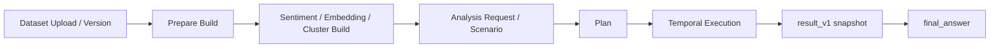

# 목표 스택

## 목적

- Python MVP에서 운영형 분석 실행 구조로 옮길 때 기준이 되는 런타임 경계를 정리한다.
- 세부 구현보다 안정된 역할 분리를 기준으로 본다.

## 핵심 구성

| 구성 | 역할 |
| --- | --- |
| Go control plane | API, dataset/execution orchestration, workflow 시작점 |
| Temporal | 장시간 workflow, retry, waiting, resume |
| Postgres | 프로젝트, dataset version, execution, build job 메타데이터 |
| Artifact storage | Parquet/JSON artifact와 실행 결과 저장 |
| DuckDB | structured 계산과 scan |
| Python AI worker | planner, dataset build, search, evidence, final answer |
| Rust worker | 확인 필요: 향후 hot path 최적화 후보 |

## 현재 실행 흐름

## 설계 원칙

- control plane과 계산 worker를 분리한다.
- workflow 상태는 worker 메모리가 아니라 Temporal과 DB metadata로 관리한다.
- structured와 unstructured를 같은 execution contract 안에서 다룬다.
- 결과는 요약 문장만 아니라 evidence와 metadata까지 함께 남긴다.
- prompt, profile, skill 메타데이터는 코드 하드코딩보다 registry를 우선한다.

## 현재 정렬 상태

- control plane, dataset build, execution, final answer 경로는 현재 목표 스택과 맞춰져 있다.
- `prepare=eager`, `sentiment / embedding / cluster=lazy` build 정책이 반영돼 있다.
- full-dataset `embedding_cluster`는 precomputed cluster artifact를 우선 읽는다.
- `확인 필요:` Rust worker는 아직 hot path runtime에 연결되지 않았다.
- `확인 필요:` Temporal workflow history 장기 보존은 아직 dev server 기본값을 따른다.

## 관련 문서

- 저장 구조 변화: [unstructured_storage_transition.md](unstructured_storage_transition.md)
- 언어 책임 구분: [language_roles.md](language_roles.md)
- 현재 제품 스냅샷: [../project_summary.md](../project_summary.md)
