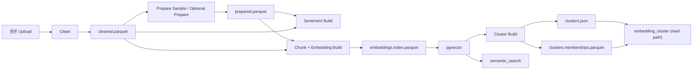

# 비정형 저장 구조 전환

## 목적

- 비정형 dataset build를 `JSONL sidecar` 중심 경로에서 `Parquet + vector index + materialized artifact` 구조로 옮긴 이유와 현재 채택 상태를 정리한다.
- 상세 구현 메모보다 현재 저장 계약과 남은 과제를 중심으로 본다.

## 현재 채택 구조

| 계층 | 현재 기본 형식 | 핵심 키 |
| --- | --- | --- |
| raw upload | 원본 CSV/TXT/JSONL | `dataset_version_id` |
| cleaned dataset | `cleaned.parquet` | `row_id`, `source_row_index`, `cleaned_text` |
| prepared dataset | `prepared.parquet` | `row_id`, `source_row_index` |
| sentiment sidecar | `sentiment.parquet` | `row_id`, `source_row_index` |
| chunk dataset | `chunks.parquet` | `chunk_id`, `row_id`, `chunk_index` |
| embedding index source | `embeddings.index.parquet` | `chunk_id` |
| retrieval index | `pgvector` | `chunk_id` |
| cluster summary artifact | `clusters.json` | `cluster_id`, `document_count` |
| cluster membership artifact | `clusters.memberships.parquet` | `cluster_id`, `chunk_id`, `row_id` |

## 현재 실행 흐름

## 현재 계약

- dataset version metadata는 `cleaned_ref`, `prepared_ref`, `sentiment_ref`, `chunk_ref`, `embedding_index_ref`, `cluster_ref`, `cluster_summary_ref`, `cluster_membership_ref` 같은 logical ref를 저장한다.
- `prepare_uri`, `sentiment_uri`, `embedding_uri` 같은 기존 URI 필드는 호환을 위해 유지하지만, 내부 실행은 ref와 format을 우선 본다.
- 분석 실행 소스는 `prepared ready -> cleaned ready -> raw` 순서로 결정한다.
- `clean`이 queued / cleaning / failed / stale이면 downstream build를 먼저 만들지 않는다.
- `semantic_search`는 `pgvector`와 `chunk_ref`를 우선 사용한다.
- full-dataset `embedding_cluster`는 precomputed `cluster_ref`를 우선 사용하고, subset 경로만 on-demand fallback을 허용한다.
- `issue_cluster_summary`와 `issue_evidence_summary`는 필요할 때 `cluster_membership_ref`를 사용해 sample / evidence를 보강한다.

## 왜 이렇게 바꿨나

- 같은 dataset을 step마다 다시 읽는 비용을 줄이기 위해
- row 전체 복제보다 `row_id`, `chunk_id` 참조 중심으로 옮기기 위해
- dense retrieval과 cluster 결과를 execution 시점 계산이 아니라 dataset artifact로 다루기 위해
- rerun/diff와 execution snapshot에서 같은 artifact를 재사용하기 위해

## 남은 과제

1. subset cluster 전략을 명확히 정리
2. `cluster_membership`를 sidecar parquet로 계속 둘지, 조회량이 늘면 DB로 승격할지 판단
3. `embedding_cluster` on-demand fallback을 얼마나 오래 유지할지 판단
4. `확인 필요:` 대용량 dataset 기준 메모리 회귀 테스트와 운영 한계치 고정
5. `확인 필요:` OpenAI dense embedding end-to-end 운영 검증

## 참고

- 현재 제품 요약: [../project_summary.md](../project_summary.md)
- 목표 스택: [target_stack.md](target_stack.md)
- 개발용 Postgres 재초기화: [../operations/dev_postgres_reset.md](../operations/dev_postgres_reset.md)
