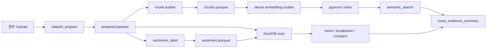

# 비정형 저장 구조 전환 설계

## 목적

- 현재 `JSONL sidecar` 중심의 비정형 dataset build 경로를 운영형 저장 구조로 옮기기 위한 기준을 정의한다.
- `festival.csv` 같은 대용량 비정형 dataset에서 `prepare -> sentiment -> embedding -> retrieval` 흐름이 파일 중복과 메모리 재적재에 과하게 의존하지 않도록 만든다.
- 기존 `dataset_version`, `execution`, `artifact` 계약은 한 번에 깨지지 않도록 단계적으로 전환한다.

## 현재 구현 관찰

- `dataset_prepare`는 `prepared.jsonl` artifact를 만든다.
- `sentiment_label`은 `sentiment.jsonl` artifact를 만든다.
- `embedding`은 `embeddings.jsonl` artifact를 만든다.
- control plane은 `dataset_versions.prepare_uri`, `sentiment_uri`, `embedding_uri`에 이 경로를 저장한다.
- Python worker는 `.csv`, `.jsonl`, `.txt`를 읽을 때 대부분 전체 row를 메모리 `list`로 올린다.
- embedding sidecar도 전체 record를 메모리로 읽어 cosine similarity와 clustering에 사용한다.
- 현재 `embedding`은 dense vector가 아니라 `token_counts + norm`을 저장하는 `token-overlap-v1`에 가깝다.

현재 코드 기준 확인 지점:
- `workers/python-ai/src/python_ai_worker/skills/dataset_build.py`
- `workers/python-ai/src/python_ai_worker/runtime/common.py`
- `workers/python-ai/src/python_ai_worker/runtime/artifacts.py`
- `apps/control-plane/internal/service/datasets.go`
- `apps/control-plane/internal/store/postgres.go`

## 현재 구조의 한계

1. 같은 dataset이 `raw -> prepared -> sentiment -> embedding`으로 갈수록 row 전체가 반복 저장된다.
2. worker가 artifact를 다시 읽을 때 스트리밍보다 전체 메모리 적재에 가깝다.
3. `dataset_name`, `prepare_uri`, `embedding_uri`가 파일 경로 중심이라 저장 포맷 교체가 어렵다.
4. embedding 이름과 달리 실제로는 dense semantic retrieval이 아니라 token vector 기반 검색이다.
5. 이후 chunk 단위 embedding이나 ANN index를 붙이려면 `row_id`, `chunk_id` 같은 안정된 키가 먼저 필요하다.

## 목표 원칙

- 원본 upload는 불변 소스로 유지한다.
- 파생 데이터는 row 전체 복제보다 `row_id`, `chunk_id` 기준 참조를 우선한다.
- 대용량 scan은 `Parquet + DuckDB`에 맞춘다.
- dense retrieval은 별도 vector index를 둔다.
- Postgres는 메타데이터와 실행 계약 저장소 역할을 유지한다.
- 기존 API는 가능한 한 `URI` 필드를 유지하되, 내부적으로는 `ref + format`으로 전환한다.

## 목표 저장 계층

| 계층 | 권장 형식 | 핵심 키 | 주 소비자 | 비고 |
| --- | --- | --- | --- | --- |
| raw upload | 원본 CSV/TXT/JSONL | `dataset_version_id` | upload, replay, 감사 | 현재와 동일하게 보존 |
| prepared dataset | `prepared.parquet` | `row_id`, `source_row_index` | filter, trend, breakdown, taxonomy | `normalized_text`, quality flag 포함 |
| sentiment sidecar | `sentiment.parquet` | `row_id` | sentiment summary | prepared row를 다시 복제하지 않음 |
| chunk dataset | `chunks.parquet` | `chunk_id`, `row_id`, `chunk_index` | embedding, evidence, retrieval | 긴 문서 chunk 분리 |
| vector index | `pgvector` 1차 권장 | `chunk_id` | semantic search, clustering 후보 | Postgres 운영 경계를 재사용 |
| execution artifact | JSONB + artifact storage | `execution_id`, `step_id` | result, rerun, diff | 현재 계약 유지 |

## 목표 실행 흐름

## 권장 계약 변화

단기:
- `prepare_uri`, `sentiment_uri`, `embedding_uri` 필드는 유지한다.
- 대신 `dataset_versions.metadata`에 아래 ref를 같이 둔다.

권장 metadata key:
- `storage_contract_version=unstructured-storage-v2`
- `prepared_ref`
- `prepared_format=parquet`
- `sentiment_ref`
- `sentiment_format=parquet`
- `chunk_ref`
- `chunk_format=parquet`
- `embedding_index_ref`
- `embedding_provider`
- `embedding_vector_dim`
- `row_id_column=row_id`
- `chunk_id_column=chunk_id`

중기:
- `dataset_name`과 `embedding_uri`를 절대 파일 경로가 아니라 `logical ref`로 해석하는 계층을 control plane 또는 worker runtime에 둔다.

장기:
- `dataset_versions`의 URI 필드만으로 관리하지 않고 `dataset_artifacts` 같은 별도 테이블로 분리하는 것을 권장한다.
- 확인 필요: 별도 `dataset_artifacts` 테이블이 필요한 시점은 artifact 종류 수와 retention 정책을 보고 정하는 편이 맞다.

## skill별 영향

| 범위 | 현재 입력 | 목표 입력 | 전환 포인트 |
| --- | --- | --- | --- |
| `dataset_prepare` | raw file path | raw file path + output ref | 출력만 `prepared.parquet`로 변경 |
| `sentiment_label` | prepared JSONL path | `prepared_ref` | row 복제 대신 `row_id` 기준 sidecar 생성 |
| `embedding` | prepared dataset path | `chunk_ref` | chunk 생성과 embedding 생성을 분리 |
| `semantic_search` | `embedding_uri` JSONL | `embedding_index_ref` | file scan에서 vector retrieval로 전환 |
| `issue_evidence_summary` | selected snippets | `chunk_id -> chunk_text -> row_id` | citation granularity 향상 |
| `document_filter` / `time_bucket_count` / `meta_group_count` | file path | `prepared_ref` 또는 resolved parquet path | DuckDB scan 또는 streaming reader와 연결 가능 |
| `issue_sentiment_summary` | sentiment JSONL path | `sentiment_ref` | distribution 계산 시 row merge 필요 |

## 구현 순서

### Phase 1. 호환 계층 추가

- worker runtime에 `.parquet` reader 추상화를 추가한다.
- `dataset_versions.metadata`에 `*_ref`, `*_format` 키를 저장할 수 있게 한다.
- 기존 JSONL 경로는 fallback으로 유지한다.

### Phase 2. prepare / sentiment 전환

- `dataset_prepare`가 `prepared.parquet`를 쓴다.
- 모든 prepared row에 `row_id`를 넣는다.
- `sentiment_label`은 `row_id`, `sentiment_label`, `confidence`, `reason`, `prompt_version` 중심의 `sentiment.parquet`를 쓴다.

### Phase 3. chunk / embedding 전환

- prepared dataset에서 `chunks.parquet`를 만든다.
- chunk는 `chunk_id`, `row_id`, `chunk_index`, `chunk_text`, `char_start`, `char_end`를 가진다.
- dense embedding은 chunk 단위로 계산하고 vector index에 적재한다.

### Phase 4. retrieval / evidence 전환

- `semantic_search`는 vector index에서 `chunk_id`를 검색한다.
- `issue_evidence_summary`는 chunk citation을 우선 사용한다.
- clustering은 dense embedding 기반으로 옮기거나, 당분간 token fallback을 유지한다.

### Phase 5. JSONL 축소

- smoke와 worker가 Parquet를 기본 경로로 사용하게 바꾼다.
- JSONL은 debug export 또는 migration fallback으로만 남긴다.
- `embedding_uri`라는 이름도 장기적으로는 `embedding_index_ref`로 바꾸는 편이 낫다.

## 구현 우선순위

1. `prepared.parquet` 전환
2. `row_id` 도입
3. `sentiment.parquet` 전환
4. `.parquet` reader + DuckDB scan 경로 도입
5. chunk builder
6. dense embedding + `pgvector`
7. semantic retrieval 교체

## 기술 선택 메모

- `Parquet`
  - 컬럼 스캔, 압축, schema 유지 측면에서 JSONL보다 유리하다.
- `DuckDB`
  - 현재 stack에 이미 있고 Parquet scan과 잘 맞는다.
- `pgvector`
  - 이미 Postgres가 있으므로 1차 운영 복잡도를 크게 늘리지 않는다.
- `Qdrant` 등 별도 vector DB
  - 확인 필요: chunk 수와 검색 latency 요구가 `pgvector` 범위를 넘을 때 별도 검토한다.

## 구현 시 주의점

- 현재 `workers/python-ai/pyproject.toml`의 dependency는 비어 있다.
- 확인 필요: Parquet writer는 `pyarrow`를 넣을지, DuckDB Python 경로를 추가할지 먼저 결정해야 한다.
- 현재 control plane의 `datasetSourceForUnstructured`, `derivePrepareURI`, `deriveSentimentURI`, `deriveEmbeddingURI`는 파일 경로 계약을 전제로 한다.
- 따라서 1차 구현은 필드 이름을 유지한 채 포맷과 metadata를 늘리는 방향이 안전하다.

## 완료 기준

- `festival.csv` 같은 비정형 dataset에서 prepare와 sentiment가 JSONL이 아니라 Parquet로 생성된다.
- unstructured support skill이 Parquet 입력을 읽을 수 있다.
- semantic search가 dense vector index를 사용할 수 있다.
- rerun/diff를 위한 execution contract는 기존과 같은 수준으로 유지된다.
