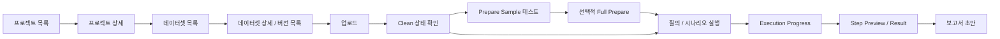

# 프론트 연동 Handoff

## 목적

- 프론트 작업자가 현재 제품 흐름과 필수 API를 빠르게 확인할 수 있게 정리한다.
- 세부 schema는 `docs/api/openapi.frontend.yaml`을 기준으로 보고, 이 문서는 화면 연결 순서와 상태 판단 기준만 다룬다.
- 확인 필요: 실제 화면명과 메뉴 구조는 `apps/web` 구현이 확정되면 갱신한다.

## 기본 원칙

- 일반 사용자는 `dataset_id`를 선택하고, 백엔드는 해당 dataset의 active dataset version을 기준으로 분석한다.
- 고급 모드에서만 특정 `dataset_version_id` 선택을 노출한다.
- dataset version 분석 소스는 `prepared ready -> cleaned ready -> raw` 순서로 해석한다.
- `clean`은 업로드 직후 자동 실행되는 기본 단계다.
- `prepare`는 비용이 드는 LLM 정제 단계라서 `prepare_sample`로 먼저 확인하고, 필요할 때 full prepare를 실행한다.
- `sentiment / embedding / cluster`는 질문이나 실행 plan에서 필요할 때 lazy build로 만든다.

## 사용자 흐름

## 화면별 API 기준

| 화면/영역 | 주요 API | 프론트 판단 |
| --- | --- | --- |
| 프로젝트 목록 | `GET /projects` | 프로젝트 카드와 현황 카운트 표시 |
| 프로젝트 생성 | `POST /projects` | 생성 후 프로젝트 상세로 이동 |
| 프로젝트 상세 | `GET /projects/{project_id}` | 프로젝트 단위 dataset / prompt / scenario 진입점 |
| 데이터셋 목록 | `GET /projects/{project_id}/datasets` | active version 유무와 최신 상태 표시 |
| 데이터셋 상세 | `GET /projects/{project_id}/datasets/{dataset_id}` | dataset 기본 정보와 active version 표시 |
| 버전 목록 | `GET /projects/{project_id}/datasets/{dataset_id}/versions` | 업로드 히스토리와 active version 선택 |
| 버전 상세 | `GET /projects/{project_id}/datasets/{dataset_id}/versions/{version_id}` | source summary, build jobs, stage status 표시 |
| active version 변경 | `PUT /projects/{project_id}/datasets/{dataset_id}/active_version` | 이후 분석 기본 대상 변경 |
| active version 해제 | `DELETE /projects/{project_id}/datasets/{dataset_id}/active_version` | 분석 실행 전 선택 필요 상태로 표시 |
| 데이터 업로드 | `POST /projects/{project_id}/datasets/{dataset_id}/uploads` | 업로드 완료 후 version 상세로 이동 |
| 원본 다운로드 | `GET /projects/{project_id}/datasets/{dataset_id}/versions/{version_id}/source_download` | 업로드 원본 확인 |
| clean 재실행 | `POST /projects/{project_id}/datasets/{dataset_id}/versions/{version_id}/clean_jobs` | clean 실패/정책 변경 시 수동 재실행 |
| prepare sample | `POST /projects/{project_id}/datasets/{dataset_id}/versions/{version_id}/prepare_sample` | 비용 낮은 샘플 테스트 |
| prepare 실행 | `POST /projects/{project_id}/datasets/{dataset_id}/versions/{version_id}/prepare_jobs` | 샘플 확인 후 full prepare |
| prepare 결과 | `GET /projects/{project_id}/datasets/{dataset_id}/versions/{version_id}/prepare_preview` | prepared row preview |
| prepare 다운로드 | `GET /projects/{project_id}/datasets/{dataset_id}/versions/{version_id}/prepare_download` | prepared CSV 다운로드 |
| sentiment 실행 | `POST /projects/{project_id}/datasets/{dataset_id}/versions/{version_id}/sentiment_jobs` | 감성 분석 필요 시 실행 |
| sentiment 결과 | `GET /projects/{project_id}/datasets/{dataset_id}/versions/{version_id}/sentiment_preview` | 감성 label sample 표시 |
| sentiment 다운로드 | `GET /projects/{project_id}/datasets/{dataset_id}/versions/{version_id}/sentiment_download` | sentiment CSV 다운로드 |
| build jobs | `GET /projects/{project_id}/datasets/{dataset_id}/versions/{version_id}/build_jobs` | clean/prepare/sentiment/embedding/cluster 상태 표시 |
| build job 상세 | `GET /projects/{project_id}/dataset_build_jobs/{job_id}` | 실패 원인과 진행률 표시 |
| 질의 생성 | `POST /projects/{project_id}/analysis_requests` | plan 생성 또는 요청 저장 |
| plan 실행 | `POST /projects/{project_id}/plans/{plan_id}/execute` | execution 생성 |
| execution 목록 | `GET /projects/{project_id}/executions` | 수행 결과 리스트 |
| execution progress | `GET /projects/{project_id}/executions/{execution_id}/progress` | 단계 진행률, waiting dependency 표시 |
| execution events | `GET /projects/{project_id}/executions/{execution_id}/events` | 로그/타임라인 표시 |
| step preview | `GET /projects/{project_id}/executions/{execution_id}/steps/{step_id}` | 단계별 중간 결과 표시 |
| result | `GET /projects/{project_id}/executions/{execution_id}/result` | 최종 결과와 final answer 표시 |

## Dataset Version 상태 표시

| 상태 | 표시 기준 | 사용자 액션 |
| --- | --- | --- |
| `clean_status=queued/running/cleaning` | 정제 진행 중 | 진행률 또는 build job 상태 표시 |
| `clean_status=ready` | cleaned artifact 사용 가능 | 질의 실행 가능, prepare sample 가능 |
| `clean_status=failed/stale` | downstream build 금지 | 오류 확인 후 clean 재실행 |
| `prepare_status=not_requested` | full prepare 미실행 | 필요 시 prepare sample 먼저 실행 |
| `prepare_status=ready` | prepared artifact 우선 사용 | 질의 실행 시 prepared source 사용 |
| `sentiment_status=not_requested` | 감성 분석 미실행 | 감성 기반 질문 시 lazy build 예상 |
| `embedding_status=not_requested` | embedding 미실행 | semantic/cluster 질문 시 lazy build 예상 |

## 프론트 구현 메모

- dataset version 상세 화면은 `metadata` raw dump보다 `source_summary`, stage status, `build_jobs` 중심으로 구성한다.
- `prepare_sample`은 저장용 결과가 아니라 프롬프트 검증용 preview로 취급한다.
- full prepare는 비용과 시간이 큰 작업이므로 버튼 실행 전 sample 결과와 예상 비용 안내가 필요하다.
- execution이 `waiting`이면 `progress.build_dependencies`와 latest event의 `waiting_for`를 우선 보여준다.
- `result_v1`과 `final_answer`는 최종 결과 화면의 기본 표시 데이터로 사용한다.

## 미정 사항

| 항목 | 내용 | 상태 |
| --- | --- | --- |
| dataset 자동 선택 layer | 질문에 맞는 dataset/version 추천은 아직 LLM 없이 명확히 구현하지 않았다. | 확인 필요 |
| report draft 화면 | API와 화면 흐름은 별도 확정이 필요하다. | 확인 필요 |
| scenario 편집 화면 | strict scenario 중심으로 시작하되 프론트 UX는 별도 정리 필요하다. | 확인 필요 |
| progress 예상 시간 | build progress는 일부 지원하지만 남은 시간 예측은 아직 고정 계약이 아니다. | 확인 필요 |
