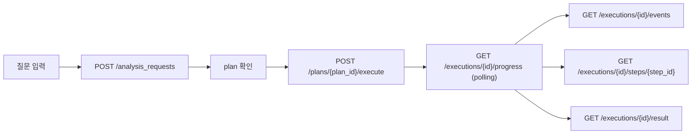

# 프론트 API Handoff

이 문서는 `apps/web` 또는 별도 프론트 클라이언트가 현재 control-plane API를 어떻게 붙이면 되는지 정리한다.

기본 전제:
- planner는 현재 **동기**로 동작한다.
- execution은 `queued / running / waiting / completed / failed` 상태를 가진다.
- `waiting` 상태일 때는 dataset build dependency를 같이 봐야 한다.
- `result_v1`는 실행 결과의 기준 snapshot이고, `final_answer`는 그 위에 얹는 사용자용 answer layer다.

## 1. 권장 화면 흐름

## 2. 화면별 API

### 2.1 공통 초기 상태

- 런타임/운영 상태
  - `GET /runtime_status`
- 프로젝트 운영 요약
  - `GET /projects/{project_id}/operations/summary`

이 화면은 필수는 아니지만, 프론트 운영 화면이 있으면 먼저 붙이는 편이 좋다.

### 2.2 질문 입력 -> 플래닝

- 질문 제출
  - `POST /projects/{project_id}/analysis_requests`
- 필요 시 request 재조회
  - `GET /projects/{project_id}/analysis_requests/{request_id}`
- plan 재조회
  - `GET /projects/{project_id}/plans/{plan_id}`

중요:
- planner는 현재 sync이므로 별도 `planning` 서버 상태는 없다.
- 프론트에서는 `POST /analysis_requests` 요청이 pending인 동안만 로컬 로딩 상태로 `플래닝중`을 표시한다.

플래닝 결과에서 주로 보는 필드:
- `plan.plan_id`
- `plan.steps[]`
- `plan.question`
- `plan.answer_mode`

### 2.3 실행 시작

- plan 실행
  - `POST /projects/{project_id}/plans/{plan_id}/execute`

응답에서 필요한 값:
- `execution.execution_id`
- `execution.status`
- `job_id`
  - `확인 필요:` 현재 workflow starter 구현에 따라 항상 채워지지 않을 수 있다.

### 2.4 실행 진행 화면

- execution progress
  - `GET /projects/{project_id}/executions/{execution_id}/progress`
- execution event timeline
  - `GET /projects/{project_id}/executions/{execution_id}/events`
- step detail / partial result
  - `GET /projects/{project_id}/executions/{execution_id}/steps/{step_id}`

`progress`에서 주로 보는 필드:
- `status`
- `total_steps`
- `completed_steps`
- `failed_steps`
- `last_event_at`
- `running_step`
- `waiting`
- `build_dependencies[]`
- `steps[]`
- `available_artifacts[]`
- `result_preview`
- `diagnostics`

#### 상태 해석

- `queued`
  - Temporal workflow enqueue 이후 아직 worker가 잡지 않은 상태
- `running`
  - step 실행 중
- `waiting`
  - dataset build dependency를 기다리는 상태
- `completed`
  - 결과 조회 가능
- `failed`
  - 실패 이유를 `diagnostics.failure_reason`와 events에서 같이 확인

#### waiting 상태에서 추가로 볼 것

`progress.build_dependencies[]`에서:
- `build_type`
- `status`
- `ready`
- `waiting_for`
- `latest_job`

`latest_job`가 있으면 여기서:
- `latest_job.status`
- `latest_job.diagnostics.retry_count`
- `latest_job.diagnostics.last_error_type`
- `latest_job.diagnostics.last_error_message`

### 2.5 step 단위 확인

- `GET /projects/{project_id}/executions/{execution_id}/steps/{step_id}`

이 응답은 분석팀이 “어느 step 결과가 이상한지” 볼 때 쓴다.

주요 필드:
- `status`
- `started_at`
- `completed_at`
- `artifact_key`
- `artifact_ref`
- `summary`
- `warnings`
- `selection_mode`
- `usage`
- `preview`
- `events[]`

`preview`는 step마다 shape가 조금 다르다. 프론트에서는 skill마다 완전 고정 레이아웃을 만들기보다, 공통 필드 + preview card 패턴으로 붙이는 것이 안전하다.

### 2.6 최종 결과

- `GET /projects/{project_id}/executions/{execution_id}/result`

주요 필드:
- `result_v1`
- `final_answer`
- `diagnostics`
- `contract`
- `artifacts`

표시 우선순위:
1. `final_answer`
2. 없으면 `result_v1.answer`

추가 참고:
- `diagnostics.final_answer_status`
- `diagnostics.artifact_payload_bytes`
- `diagnostics.largest_artifact_key`

## 3. dataset / build 연동 화면

### 3.1 dataset version / build 상태

- `GET /projects/{project_id}/datasets/{dataset_id}/versions/{version_id}`
- `GET /projects/{project_id}/datasets/{dataset_id}/versions/{version_id}/build_jobs`
- `GET /projects/{project_id}/dataset_build_jobs/{job_id}`

이 화면에서는:
- `prepare_status`
- `sentiment_status`
- `embedding_status`
- cluster 관련 metadata
- build job `status / diagnostics`
를 같이 보여주면 된다.

### 3.2 cluster drill-down

- `GET /projects/{project_id}/datasets/{dataset_id}/versions/{version_id}/clusters/{cluster_id}/members`

추천 용도:
- cluster detail drawer
- cluster evidence panel

쿼리:
- `limit`
- `samples_only`

## 4. catalog / 운영 설정 화면

- dataset profile registry
  - `GET /dataset_profiles`
- prompt catalog
  - `GET /prompt_catalog`
- rule catalog
  - `GET /rule_catalog`
- 검증 결과
  - `GET /dataset_profiles/validate`

추천 사용 방식:
- 운영/설정 탭에서는 `catalog` API를 기본 사용
- 경고/오류 화면에서는 `validate` API를 사용

## 5. 권장 polling 규칙

### 실행 상세 화면

- `progress`
  - `queued / running / waiting` 동안 `2-3초`
  - `completed / failed`면 중단
- `events`
  - 타임라인 패널이 열려 있을 때만 `3-5초`
- `step preview`
  - 사용자가 step을 펼쳤을 때 on-demand
  - 해당 step이 `running`이면 `3-5초`

### build job 화면

- `build_jobs`
  - `queued / running`이 하나라도 있으면 `2-3초`
  - 모두 `completed / failed`면 중단

## 6. UI 구현 팁

- planner는 async 상태가 없으므로, `플래닝중`은 프론트 local pending으로만 처리한다.
- execution detail 화면은 `progress`를 기준 surface로 삼고, `events`와 `step preview`는 drill-down 패널로 두는 편이 좋다.
- `waiting`은 숨기지 말고 `waiting_for`와 `build_dependencies`를 그대로 노출한다.
- step preview의 `preview`는 skill마다 조금 다를 수 있으므로, 공통 card + raw JSON debug panel 구조가 안전하다.
- cluster 계열 step은 `cluster_execution_mode`, `cluster_materialization_scope`, `cluster_fallback_reason`를 함께 보여주면 디버깅이 쉽다.

## 7. 현재 공백

- planner async 상태는 아직 없다.
- SSE / websocket은 없다. polling 기준으로 붙여야 한다.
- `확인 필요:` step preview용 preview shape는 skill별로 추가 보강 가능성이 있다.
