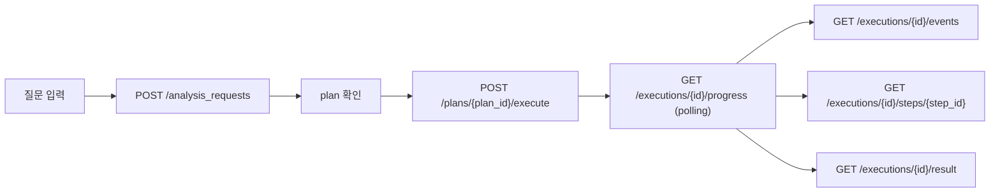

# 프론트 API Handoff

이 문서는 `apps/web` 또는 별도 프론트 클라이언트가 현재 control-plane API를 어떤 순서로 붙이면 되는지 정리한다.

기본 전제:
- planner는 현재 동기다.
- execution 상태는 `queued / running / waiting / completed / failed`다.
- `waiting`이면 `build_dependencies`를 같이 본다.
- `result_v1`가 기준 snapshot이고, `final_answer`는 그 위의 사용자용 표현 레이어다.

## 1. 권장 화면 흐름

## 화면별 최소 API

| 화면 | API | 주로 보는 필드 |
| --- | --- | --- |
| 운영 상태 | `GET /runtime_status`, `GET /projects/{project_id}/operations/summary` | 런타임 모드, 상태 집계 |
| 질문 입력 / 플래닝 | `POST /projects/{project_id}/analysis_requests`, `GET /projects/{project_id}/plans/{plan_id}` | `plan_id`, `steps`, `question`, `answer_mode` |
| 실행 시작 | `POST /projects/{project_id}/plans/{plan_id}/execute` | `execution_id`, `status` |
| 실행 진행 | `GET /projects/{project_id}/executions/{execution_id}/progress` | `status`, `running_step`, `build_dependencies`, `steps`, `result_preview`, `diagnostics` |
| 이벤트 타임라인 | `GET /projects/{project_id}/executions/{execution_id}/events` | `events[]`, `last_event_at` |
| step detail | `GET /projects/{project_id}/executions/{execution_id}/steps/{step_id}` | `summary`, `warnings`, `preview`, `events[]` |
| 최종 결과 | `GET /projects/{project_id}/executions/{execution_id}/result` | `final_answer`, `result_v1`, `diagnostics` |
| dataset/build | `GET /projects/{project_id}/datasets/{dataset_id}/versions/{version_id}`, `GET /projects/{project_id}/datasets/{dataset_id}/versions/{version_id}/build_jobs` | build status, cluster metadata |
| cluster drill-down | `GET /projects/{project_id}/datasets/{dataset_id}/versions/{version_id}/clusters/{cluster_id}/members` | member sample, cluster detail |
| catalog | `GET /dataset_profiles`, `GET /prompt_catalog`, `GET /rule_catalog`, `GET /skill_policy_catalog` | registry/catalog |

## polling 규칙

- `progress`
  - `queued / running / waiting` 동안 `2-3초`
  - `completed / failed`면 중단
- `events`
  - 타임라인 패널이 열려 있을 때만 `3-5초`
- `step preview`
  - 펼쳤을 때 on-demand
  - 해당 step이 `running`이면 `3-5초`
- `build_jobs`
  - `queued / running`이 하나라도 있으면 `2-3초`
  - 모두 `completed / failed`면 중단

## 구현 메모

- planner는 동기라서 `플래닝중`은 프론트 local pending으로만 처리한다.
- `waiting`이면 `build_dependencies`를 그대로 노출한다.
- step `preview` shape는 skill마다 다를 수 있으므로 공통 card + raw JSON debug panel 구조가 안전하다.
- cluster 계열 step은 `cluster_execution_mode`, `cluster_materialization_scope`, `cluster_fallback_reason`를 같이 보여주는 편이 좋다.

## 현재 공백

- planner async 상태는 아직 없다.
- SSE / websocket은 없다. polling 기준으로 붙여야 한다.
- `확인 필요:` step preview용 `preview` shape는 skill별 추가 보강 여지가 있다.
