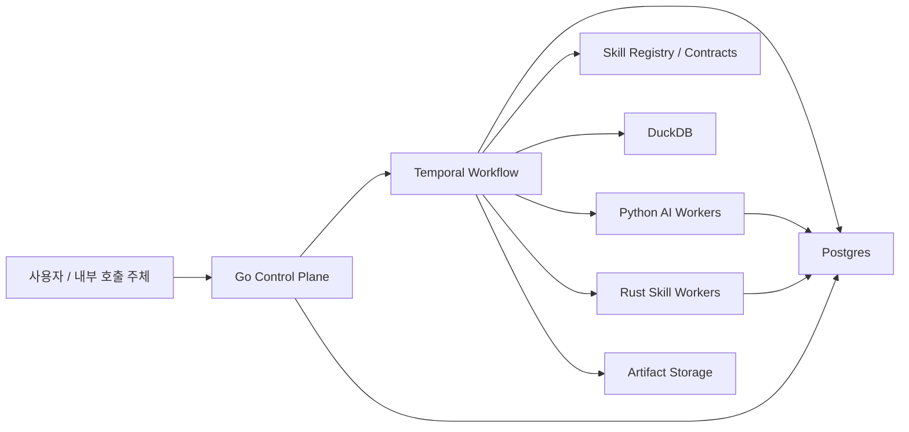

# 프로젝트 요약

## 1. 문제정의

- 확인 필요: 저장소 루트에서 `project_context.yaml`은 확인되지 않았다.
- 이 프로젝트의 목적은 질문을 바로 답변하는 챗봇이 아니라, **질문을 재실행 가능한 Skill Plan으로 고정하고, 실행 결과를 다시 비교할 수 있게 남기는 분석 실행 플랫폼**을 만드는 것이다.
- 기존 Python MVP는 제품 개념 검증에는 충분했지만, 비정형 Skill 확대와 운영형 workflow까지 감당하기에는 구조가 한 프로세스에 너무 많이 묶여 있다.

## 2. 목표 제품 방향

- 제품의 중심 흐름은 계속 `request -> plan -> execute -> rerun/diff` 이다.
- 1차 이후에는 structured 분석뿐 아니라 비정형 이슈 분석도 공식 축으로 확장한다.
- 비정형 경로는 자유형 QA보다 `이슈 요약`, `변화 비교`, `메타 분해`, `근거 제시`, `군집화` 같은 실행형 Skill 중심으로 확장한다.

## 3. 목표 스택

- `Go`: API, auth, execution control plane, Temporal orchestration 진입점
- `Temporal`: durable workflow, `waiting/retry/resume`, rerun orchestration
- `DuckDB`: structured Skill 계산 엔진
- `Postgres`: 프로젝트, dataset version, plan, execution 메타데이터 저장
- `Python workers`: planner, embeddings, semantic search, evidence generation
- `Rust workers`: CPU 집약 Skill, 토큰화, 군집화, 대용량 텍스트 처리

## 4. 시스템 구조도

## 5. 현재 상태

- `src/` 아래 Python 코드는 레거시 MVP 런타임으로 남아 있다.
- `apps/control-plane/`, `workers/python-ai/`, `workers/rust-skills/`는 목표 구조로 옮기기 위한 새 골격이다.
- 확인 필요: Docker, CI, 배포 스크립트는 아직 레거시 Python 런타임 기준이며 새 구조로 완전히 옮기지 않았다.

## 6. 기대효과

- workflow 상태 관리와 재시도를 애플리케이션 코드에서 분리해 운영 복잡도를 낮출 수 있다.
- structured Skill은 DuckDB로 올려 행 단위 Python 루프보다 더 큰 데이터셋을 안정적으로 처리할 수 있다.
- Python은 LLM/임베딩에 집중하고, Rust는 고비용 Skill만 맡겨 전체 실행 구조가 단순해진다.
- Skill이 늘어나도 언어별 책임이 분리되어 성능 병목과 팀 역할 충돌을 줄이기 쉽다.

## 7. 다음 단계

- Go control plane에서 프로젝트, dataset, analysis request, execution API를 다시 정의한다.
- Temporal workflow로 `plan -> validate -> execute -> waiting -> resume -> rerun/diff`를 옮긴다.
- structured / AI / high-performance Skill contract를 언어 중립 형태로 고정한다.
- 레거시 Python `src/` 제거 시점은 새 control plane과 worker 경로가 최소 E2E를 통과한 뒤로 잡는다.
